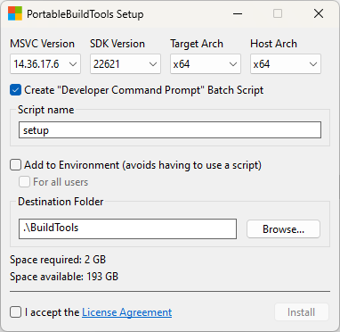

# PortableBuildTools

Portable, simple and fast installer for Visual Studio build tools.

## TODO

* Rework the entire GUI completely by someone who know how it works, with screen scaling support, like wcap.
* After clicking install, check if desired directory exists and is non-empty, if it is - display a message box saying "Desired directory is not empty."
* Indicate somehow when invalid path name is set?
* Cancel console autoscroll? Possible? EM_GETSCROLLPOS maybe?

## Credits

@mmozeiko - for the initial CLI Python [implementation](https://gist.github.com/mmozeiko/7f3162ec2988e81e56d5c4e22cde9977) of the tool
@iamvfx - for helping me figure out WinHTTP
