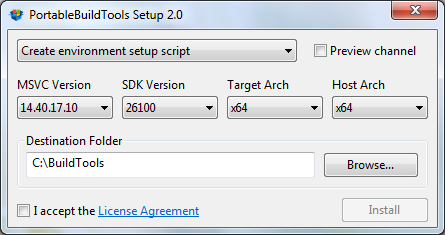

# PortableBuildTools

Portable, simple and fast installer for Visual Studio Build Tools.

Downloads standalone MSVC compiler, linker & other tools, also headers/libraries from Windows SDK, into a portable folder, without installing Visual Studio.
Has only bare minimum components - no UWP/Store/WindowsRT stuff, just files & tools for native desktop app development.

Download [latest release](https://github.com/Data-Oriented-House/PortableBuildTools/releases/latest/download/PortableBuildTools.exe).

## Command-Line Interface

The program also has a command-line interface. Run it with `?` to see usage.

## Credits

@mmozeiko - for the initial CLI Python [implementation](https://gist.github.com/mmozeiko/7f3162ec2988e81e56d5c4e22cde9977) of the tool
